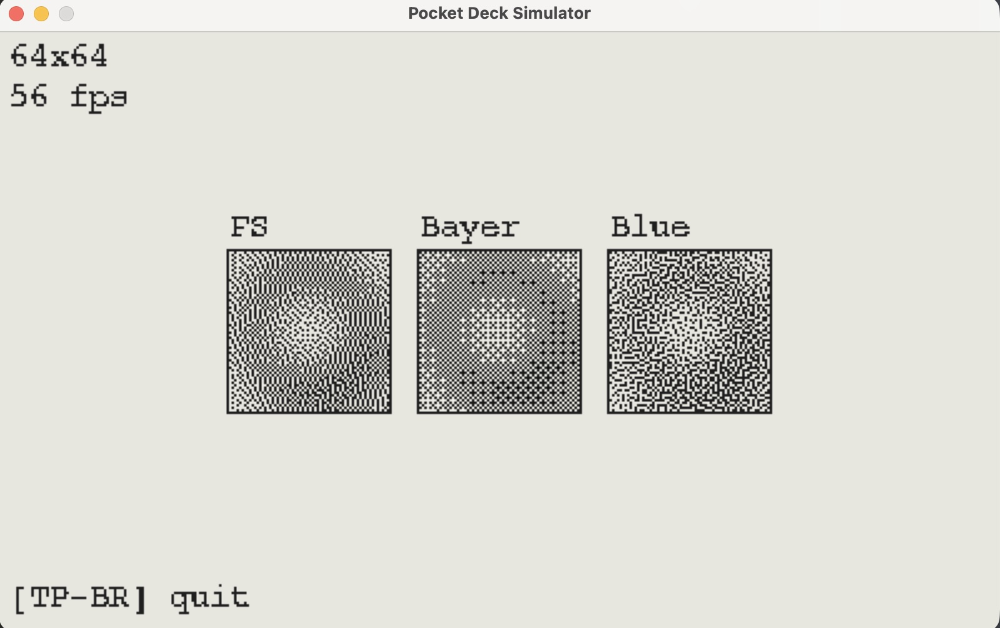
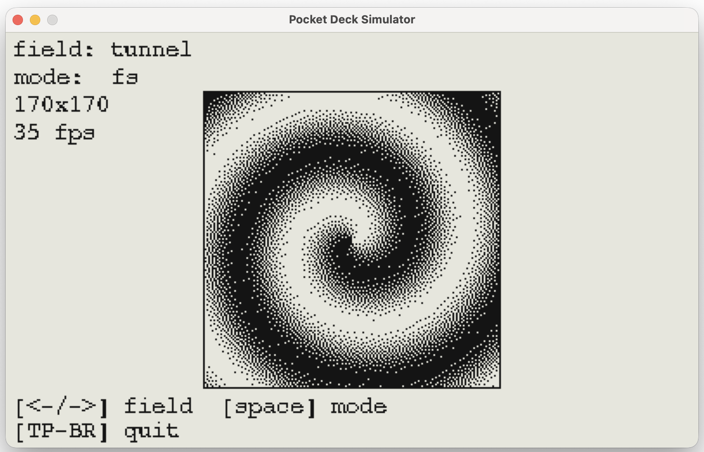
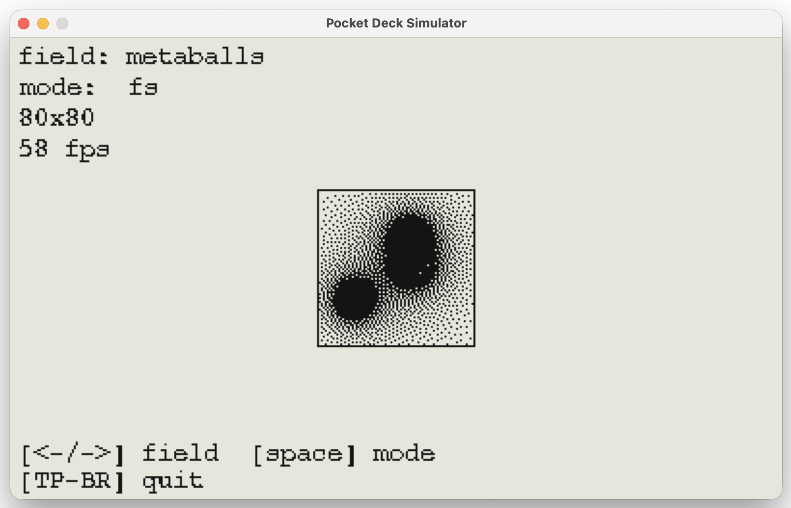
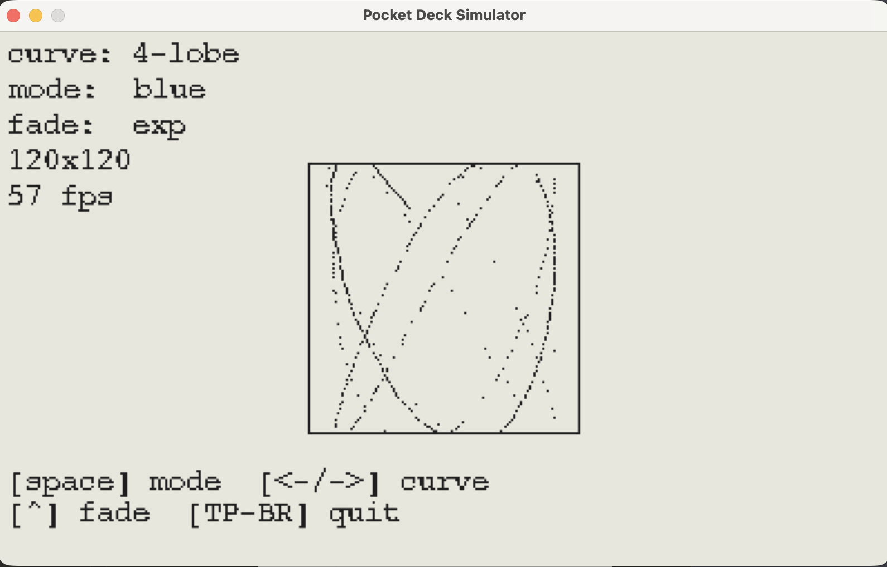

# pd-proj
Various projects for PocketDeck

* [dither-plasma](dither-plasma) - 0.4.0 - shows off a dithering algorithm and metaball-like plasma
  * dither:
  
  * tunnel:
  
  * metaballs:
  
  * lissajous:
  

# Reference

* Use [my simulator](https://github.com/nrichards/pocketdeck-dev) to see this on desktop